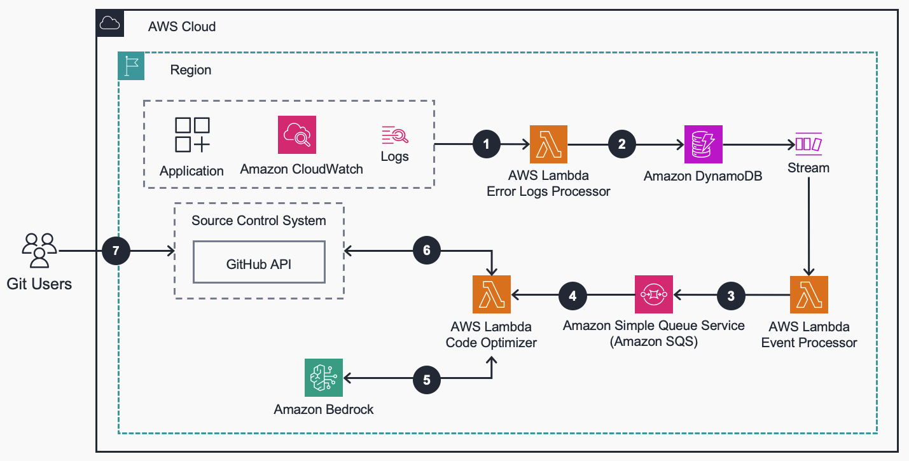
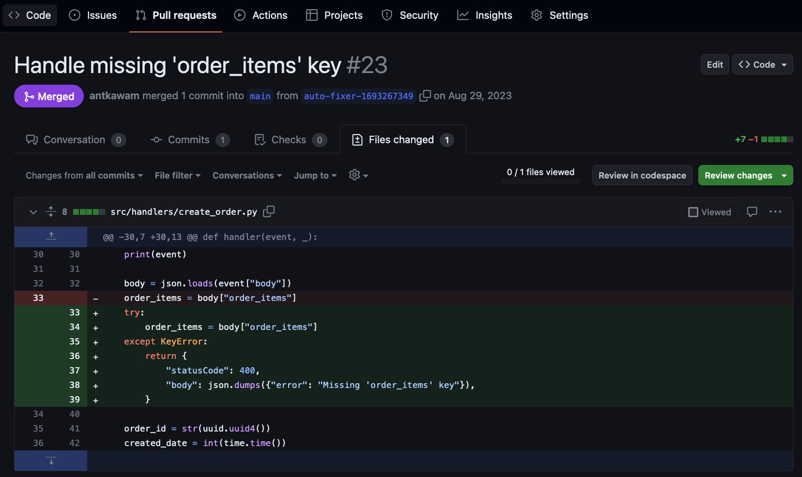

# Guidance for Self-Healing Code on AWS

## Table of Contents

1. [Overview](#overview)
   - [Cost](#cost)
2. [Prerequisites](#prerequisites)
   - [Operating System](#operating-system)
3. [Deployment Steps](#deployment-steps)
4. [Deployment Validation](#deployment-validation)
5. [Running the Guidance](#running-the-guidance)
6. [Next Steps](#next-steps)
7. [Cleanup](#cleanup)
8. [Notices](#notices)

## Overview

Any customer that creates software inevitably has bugs, but at the same time, often must compete with product and feature development pressure, which often pushes them to de-prioritize addressing bugs. These bugs can distract developers' focus, degrade user experience and cause misleading metrics about the user experience. Even if customers prioritize fixing bugs, this often requires business investment in the form of experience/skilled engineers to dedicate a large amount of time and focus in understanding and fixing bugs.

This repo contains an end to end system which combines Amazon CloudWatch, AWS Lambda, and Amazon Bedrock to create an end-to-end system which automatically detects and fixes bugs to enhance application reliability and the overall customer experience. The Log Driven Bug Fixer hooks into an application's Amazon CloudWatch Logs log group via an AWS Lambda subscription. Any logs containing application errors are sent for processing; where a Lambda function creates a prompt, including the stack trace and relevant code files, and then sends it to Amazon Bedrock (Claude v1) to generate code fixes. The modified code is then pushed into source control (git) and creates a pull request for review and deployment.



### Cost

_You are responsible for the cost of the AWS services used while running this Guidance. As of February 2024, the cost for running this Guidance with the default settings in the US East (N. Virginia) is approximately $<REPLACE_ME> per month for processing <REPLACE_ME> records._

## Prerequisites

- Python 3.9+
- AWS CLI

### Operating System

This solution supports build environments in Mac or Linux.

### AWS Account Requirements

This deployment requires that you have access to the following AWS services:

- Amazon CloudWatch
- AWS Lambda
- Amazon Bedrock
- Amazon Simple Queue Service (SQS)
- Amazon DynamoDB

## Deployment Steps

These deployment instructions are optimized to best work on Mac or Amazon Linux 2023. Deployment in another OS may require additional steps.

1. Clone the repo using command `git clone https://github.com/aws-solutions-library-samples/guidance-for-self-healing-code-on-aws.git`
2. cd to the repo folder `cd guidance-for-self-healing-code-on-aws`
3. Install packages in requirements using command `pip install -r requirement.txt`
4. Export the required environment variables:

```
# CloudFormation stack name.
export STACK_NAME=log-driven-bug-fixer

# S3 bucket to store zipped Lambda function code for deployments.
export DEPLOYMENT_S3_BUCKET=<NAME OF YOUR S3 BUCKET>

# S3 bucket to store zipped Lambda function code for deployments. i.e. artifacts/
export DEPLOYMENT_S3_BUCKET_PREFIX=<NAME OF YOUR S3 BUCKET PREFIX>

# All variables and secrets for this project will be stored under this prefix.
# You can define a different value if it's already in use.
export PARAMETER_STORE_PREFIX=/${STACK_NAME}/
```

5. Install Python dependencies and run the configuration wizard to securely store variables and secrets in SSM Parameter Store:

```
pip install -r requirements.txt
python3 bin/configure.py
```

Re-run the above script if you need to make any changes. Alternatively, you can directly modify the SSM Parameter Store values which are stored under the ${PARAMETER_STORE_PREFIX} prefix.

6. Deploy the AWS resources with CloudFormation:

```
# Create a deployment package (Lambda function source code)
cloudformation/package.sh

# Deploy the CloudFormation template
cloudformation/deploy.sh
```

7. Run the configuration script to integrate the target application's Amazon CloudWatch log group and source control details.

```
# Follow the resulting series of prompts to store configuration details in SSM Parameter Store.

python3 bin/configure.py
```

## Deployment Validation

Open CloudFormation console and verify the status of the template with the name of the stack specified in step 4 of the deployment steps.

## Running the Guidance

Upon receiving a Python stack trace in the Amazon CloudWatch log group configured in Step 7, a pull request will be created in the source control system. Note that processing can take several minutes to complete.

Example output pull request in Github:



## Next Steps

This guidance is a sample project which targets Python 3.9+ code bases. There are further opportunities to extend and enhance this system. Some suggested next steps:

- Tweak the provider-specific prompts in `src/handlers/providers` to refine responses from LLM's
- Add/modify the formatting provider to align to your specific code formatting requirements (`src/handlers/source_code.py`)
- Add source control system providers to integrate with your own systems (`src/providers/source_code.py`)

## Cleanup

1. Delete the CloudFormation stack.

```
aws cloudformation delete-stack --stack-name ${STACK_NAME}
```

2. Delete SSM Parameter Store parameters.

```
aws ssm delete-parameters-by-path --path ${PARAMETER_STORE_PREFIX}
```

## Notices

_Customers are responsible for making their own independent assessment of the information in this Guidance. This Guidance: (a) is for informational purposes only, (b) represents AWS current product offerings and practices, which are subject to change without notice, and (c) does not create any commitments or assurances from AWS and its affiliates, suppliers or licensors. AWS products or services are provided “as is” without warranties, representations, or conditions of any kind, whether express or implied. AWS responsibilities and liabilities to its customers are controlled by AWS agreements, and this Guidance is not part of, nor does it modify, any agreement between AWS and its customers._
