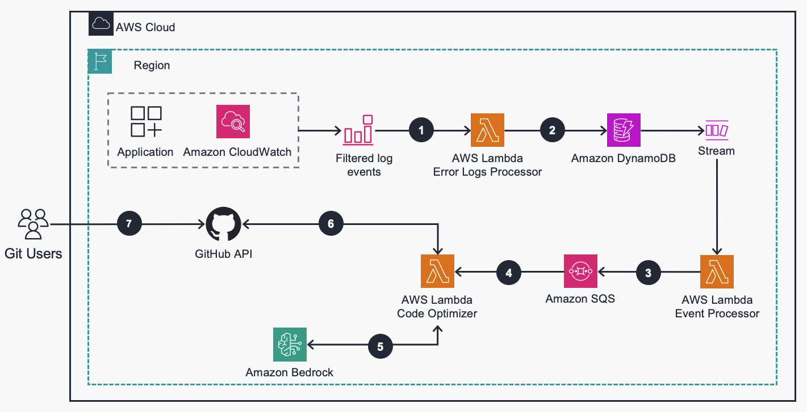

# Guidance for Self-Healing Code on AWS

## Table of Contents

1. [Overview](#overview)
   - [Cost](#cost)
2. [Prerequisites](#prerequisites)
   - [Operating System](#operating-system)
3. [Deployment Steps](#deployment-steps)
4. [Deployment Validation](#deployment-validation)
5. [Running the Guidance](#running-the-guidance)
6. [Next Steps](#next-steps)
7. [Cleanup](#cleanup)
8. [Notices](#notices)

## Overview

Any customer that creates software inevitably has bugs, but at the same time, often must compete with product and feature development pressure, which often pushes them to de-prioritize addressing bugs. These bugs can distract developers' focus, degrade user experience and cause misleading metrics about the user experience. Even if customers prioritize fixing bugs, this often requires business investment in the form of experience/skilled engineers to dedicate a large amount of time and focus in understanding and fixing bugs.

This repo contains an end to end system which combines Amazon CloudWatch, AWS Lambda, and Amazon Bedrock to create an end-to-end system which automatically detects and fixes bugs to enhance application reliability and the overall customer experience. The Log Driven Bug Fixer hooks into an application's Amazon CloudWatch Logs log group via an AWS Lambda subscription. Any logs containing application errors are sent for processing; where a Lambda function creates a prompt, including the stack trace and relevant code files, and then sends it to Amazon Bedrock (Claude v1) to generate code fixes. The modified code is then pushed into source control (git) and creates a pull request for review and deployment.



1. The AWS Lambda ‘Error Logs Processor’ function receives application error logs via an Amazon CloudWatch Logs subscription and filter. All AWS Lambda functions assume an AWS IAM role scoped with minimum permissions to access the required resources.
2. The stack trace in the application error log is md5-hashed for uniqueness and stored in an Amazon DynamoDB table to track its processing state. Each item in the table represents a unique error message.
3. The AWS Lambda function ‘Event Processor’ obtains events from Amazon DynamoDB Stream and sends to Amazon SQS for batch processing.
4. Amazon SQS enqueues messages to enable batch processing and concurrency control for the Amazon Lambda ’Code Optimizer’ function.
5. The AWS Lambda ‘Code Optimizer’ function builds a prompt that includes source code and the relevant error message. The SSH key to access the Git repository is retrieved from AWS Systems Manager Parameter Store. It invokes the Amazon Bedrock Large Language Model (LLM) with the prompt, which includes modified source code as a response.
6. The AWS Lambda ‘Code Optimizer’ function commits the modified source code into a new Git branch. The Git branch and its corresponding pull request are pushed to the source control system via GitHub API.
7. Git users review the pull request for testing and integration.

### AWS services

- [Amazon CloudWatch](https://docs.aws.amazon.com/AmazonCloudWatch/latest/monitoring/WhatIsCloudWatch.html)
- [AWS Lambda](https://docs.aws.amazon.com/lambda/latest/dg/welcome.html)
- [Amazon Bedrock](https://docs.aws.amazon.com/bedrock/latest/userguide/what-is-bedrock.html)
- [Amazon Simple Queue Service (SQS)](https://docs.aws.amazon.com/AWSSimpleQueueService/latest/SQSDeveloperGuide/welcome.html)
- [Amazon DynamoDB](https://docs.aws.amazon.com/amazondynamodb/latest/developerguide/Introduction.html)
- [AWS Systems Manager](https://docs.aws.amazon.com/systems-manager/latest/userguide/what-is-systems-manager.html)

### Cost

The following table provides a sample cost breakdown for deploying this
Guidance with the default parameters in the US East (N. Virginia) Region
for one month.

| **AWS service**   | Dimensions                                             | Monthly cost \[USD\] |
| ----------------- | ------------------------------------------------------ | -------------------- |
| Amazon DynamoDB   | Average item size 0.5kb, 0.5 RCU and 1 WCU per message | \$ 17.08             |
| Amazon CloudWatch | 33kb of logs written and stored per message            | \$ 8.77              |
| AWS Lambda        | 45 seconds execution time per unique error message     | \$ 2.43              |
| Amazon SQS        | 3 requests per message, 1k message size                | \$ 0.01              |
| Amazon Bedrock    | 1,000 input tokens, 1,000 output tokens                | \$ 32.00             |
| Total             |                                                        | \$ 60.29             |

#### Cost assumptions

- 1,000,000 error messages processed in a month (1,000 unique errors).
- Free-tier not included in costs.
- 1,000 Claude v2 input and output tokens required per message processed.
- Amazon DynamoDB table uses standard table class, on-demand capacity.
- AWS Lambda functions provisioned with 128mb memory and x86 architecture.

## Prerequisites

- Python 3.9+
- AWS CLI

## Assumptions

- Your existing application uses Amazon Cloudwatch logs. This solution currently hooks into CloudWatch log group to monitor your application logs for errors.
- You use a git based source code management platform to host your code
- Your application code is written in Python 3. The solution is currently tested only with Python 3 code bases.

### Operating System

This solution supports build environments in Mac or Linux.

### AWS Account Requirements

This deployment requires that you have access to the following AWS services:

- Amazon CloudWatch
- AWS Lambda
- Amazon Bedrock
- Amazon Simple Queue Service (SQS)
- Amazon DynamoDB
- AWS Systems Manager - Parameter Store

## Deployment Steps

These deployment instructions are optimized to best work on Mac or Amazon Linux 2023. Deployment in another OS may require additional steps.

1. Gather following information about your existing application as these are inputs needed to configure the solution

   - Git URL for your application code (eg: git@github.com:foo/bar.git)
   - API URL for your git repository (eg: https://api.github.com/repos/foo/bar)
   - Access Token or API Key for our repository. For Github, please refer [this link](https://docs.github.com/en/authentication/keeping-your-account-and-data-secure/managing-your-personal-access-tokens) for steps to create one
   - SSH private key with write permissions on your code repo.
   - Name of the AWS Cloudwatch Log group for your application eg: /aws/lambda/your-lambda

2. Clone the repo using command `git clone https://github.com/aws-solutions-library-samples/guidance-for-self-healing-code-on-aws.git`
3. cd to the repo folder `cd guidance-for-self-healing-code-on-aws`
4. Install packages in requirements using command `pip install -r requirement.txt`
5. Export the required environment variables:

```
# CloudFormation stack name.
export STACK_NAME=self-healing-code

# S3 bucket to store zipped Lambda function code for deployments.
# Note: the S3 bucket must be in the same region as the CloudFormation stack deployment region.
export DEPLOYMENT_S3_BUCKET=<NAME OF YOUR S3 BUCKET>

# All variables and secrets for this project will be stored under this prefix.
# You can define a different value if it's already in use.
export PARAMETER_STORE_PREFIX=/${STACK_NAME}/
```

6. Install Python dependencies:

```
pip3 install -r requirements.txt
```

7. Run the configuration script and provide target application's Amazon CloudWatch log group and source control details. This will securely store variables and secrets in SSM Parameter Store

```
# Follow the resulting series of prompts to store configuration details in SSM Parameter Store. This steps will use information gathered during Step 1

python3 bin/configure.py
```

Re-run the above script if you need to make any changes. Alternatively, you can directly modify the SSM Parameter Store values which are stored under the ${PARAMETER_STORE_PREFIX} prefix.

8. Deploy the AWS resources with CloudFormation:

```
# Create a deployment package (Lambda function source code)
cloudformation/package.sh

# Deploy the CloudFormation template
cloudformation/deploy.sh
```

## Deployment Validation

Open CloudFormation console and verify the status of the template with the name of the stack specified in step 4 of the deployment steps.

## Running the Guidance

Upon receiving a Python stack trace in your application's Amazon CloudWatch log group configured in Step 6, a pull request will be created in the source control system. Note that processing can take several minutes to complete. If you want a quick validation of the solution, you can inject an error into your existing application which can result in a python stack trace in your application's logs

Example output pull request in Github:


## Next Steps

This guidance is a sample project which targets Python 3.9+ code bases. There are further opportunities to extend and enhance this system. Some suggested next steps:

- Tweak the provider-specific prompts in `src/handlers/providers` to refine responses from LLM's
- Add/modify the formatting provider to align to your specific code formatting requirements (`src/handlers/source_code.py`)
- Add source control system providers to integrate with your own systems (`src/providers/source_code.py`)

## Cleanup

1. Delete the CloudFormation stack.

```
aws cloudformation delete-stack --stack-name ${STACK_NAME}
```

2. Delete SSM Parameter Store parameters.

```
aws ssm delete-parameters-by-path --path ${PARAMETER_STORE_PREFIX}
```

## Notices

_Customers are responsible for making their own independent assessment of the information in this Guidance. This Guidance: (a) is for informational purposes only, (b) represents AWS current product offerings and practices, which are subject to change without notice, and (c) does not create any commitments or assurances from AWS and its affiliates, suppliers or licensors. AWS products or services are provided “as is” without warranties, representations, or conditions of any kind, whether express or implied. AWS responsibilities and liabilities to its customers are controlled by AWS agreements, and this Guidance is not part of, nor does it modify, any agreement between AWS and its customers._
